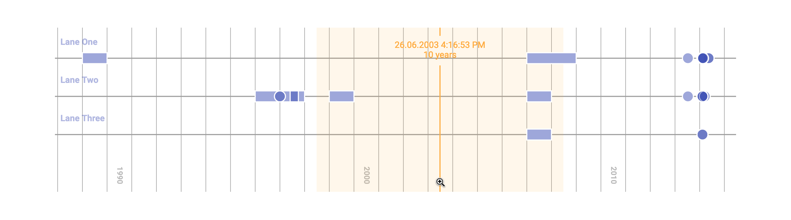
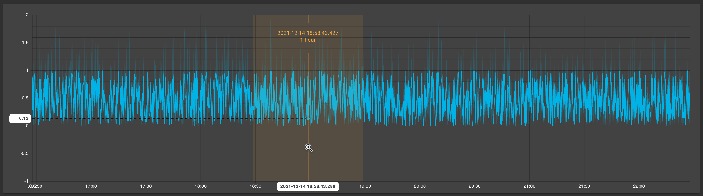

# react-svg-timeline [](https://github.com/facebook/react/blob/master/LICENSE) [](https://www.npmjs.com/package/react-svg-timeline)

A React event timeline component based on SVG. Fork of: https://github.com/netzwerg/react-svg-timeline?tab=readme-ov-file#theming
- Event Points & Periods
- Event Tooltips
- Event Lanes
- Semantic Zoom (10 Years, 1 Year, 1 Week, 1 Day, etc)
- Custom "rubber band" Zoom
- Panning

## Demo

Out of the box – **plain & simple**:



Explore our [interactive demo](https://netzwerg.github.io/react-svg-timeline-demo/) for more details on **customizations**.
The demo code can be found in the [react-svg-timeline-demo](https://github.com/netzwerg/react-svg-timeline-demo) repository.

Alternatively, you are free to use just the zooming & panning **interaction logic**, e.g. as a layer of the awesome [Nivo](https://nivo.rocks) line chart:



## Installation

`yarn add react-svg-timeline`

or

`npm install react-svg-timeline`

Note that `react` and `react-dom` (version >=16.3) must already be installed.

## Usage

This is the simplest possible way to get started:

```tsx
import * as React from 'react'
import { Timeline } from 'react-svg-timeline'

export const App = () => {
  const laneId = 'demo-lane'
  const lanes = [
    {
      laneId,
      label: 'Demo Lane',
    },
  ]
  const events = [
    {
      eventId: 'event-1',
      tooltip: 'Event 1',
      laneId,
      startTimeMillis: 1167606000000,
      endTimeMillis: 1230698892000,
    },
    {
      eventId: 'event-2',
      tooltip: 'Event 2',
      laneId: laneId,
      startTimeMillis: 1399845600000,
    },
  ]
  const dateFormat = (ms: number) => new Date(ms).toLocaleString()
  return <Timeline width={600} height={300} events={events} lanes={lanes} dateFormat={dateFormat} />
}
```

Please check the [react-svg-timeline-demo](https://github.com/netzwerg/react-svg-timeline-demo) repository for a full-fledged feature demonstration.

## Theming

To override the default theme, you can use the `theme` property.

If your project is using [Material UI](https://mui.com/), the `deriveTimelineTheme` convenience function makes it particularly easy to use the MUI theme as a basis:

```tsx
import * as React from 'react'

// MUI v4
import { useTheme } from '@material-ui/core'

// MUI v5
import { useTheme } from '@mui/material'

import { Timeline } from 'react-svg-timeline'

const App = () => {
  const materialTheme = useTheme()

  // MUI v4
  const type = materialTheme.palette.type

  // MUI v5
  const type = materialTheme.palette.mode

  const theme = deriveTimelineTheme(materialTheme.palette.mode, materialTheme)
  return <Timeline theme={theme} /** all other props here **/ />
}
```

If you would just like to override certain aspects of the default timeline theme, use the `createTimelineTheme` helper function:

```tsx
const theme = createTimelineTheme({ event: { markFillColor: 'pink' } })
```

## Library Development

### Local Development

To run the timeline locally with HMR, execute the following command:

```
yarn start
```

### Storybook

To run the storybook locally, execute the following command:

```
yarn storybook
```

### Testing

To run the tests, execute the following command:

```
yarn test
```

### Building

To build the library, execute the following command:

```
yarn build
```

### Testing a release candidate

While making changes to this library in the context of a consuming project, [yalc](https://github.com/wclr/yalc) can be very handy:

In `react-svg-timeline`:

```
yalc publish
```

In your project consuming the library:

```
yalc add react-svg-timeline
```

Note: If you previously had react-svg-timeline added via yalc, you need to remove it first:

```
yalc remove react-svg-timeline
yarn install
yalc add react-svg-timeline
```

### Publishing a release

Before publishing a release, make sure to update the version number in `package.json`.

```
git tag vX.Y.Z
(yarn npm login)
yarn npm publish
git push --tags
```

After publishing and pushing the tag, you can add a release on GitHub with autogenerated release notes.

## Acknowledgements

Thank you:

- [GitHub Corners](https://github.com/tholman/github-corners) for the callout on the example site

## License

Licensed under [MIT License](LICENSE).

&copy; Rahel Lüthy & Jan Azzati 2022
